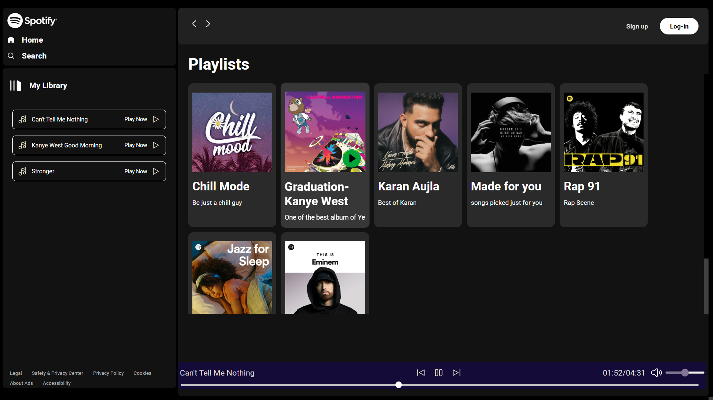
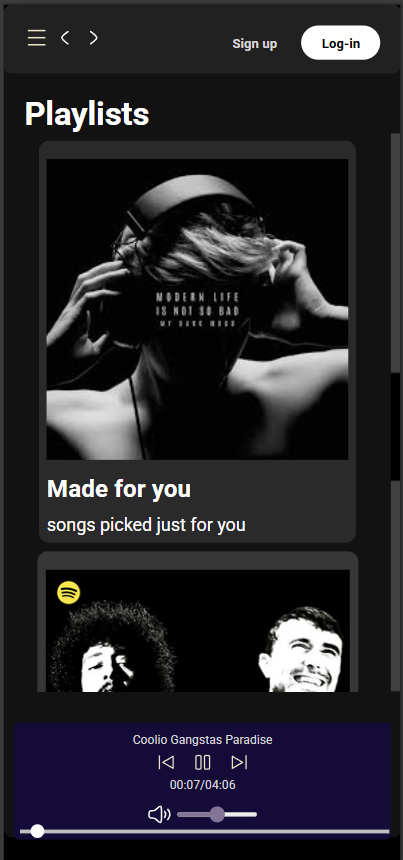

# 🎵 Spotify Clone -Simple Music Player

A full-featured Spotify-inspired music player built using **HTML**, **CSS**, and **JavaScript**. 

 Made while learning web development to understand DOM manipulation, file handling, and UI responsiveness.

Songs are organized in folders inside a `SONGS/` directory, and albums are dynamically loaded with metadata. The player is fully responsive and includes song library for each album, seekbar and volume controls.

>_This project excludes actual copyrighted songs, no copyrighted tracks are added instead._
---

## 🚀 Features

-  **Play music from  `SONGS/` folder**
-  **Album-wise playlist generation** from subfolders
-  **Album info (title & description)** from `info.json`
-  **Auto song listing** with real-time DOM updates
-  Play, Pause, Next, Previous song controls
-  Live seekbar with current time and duration
-  Volume control + Mute/Unmute toggle
-  Fully **responsive layout** with mobile-friendly sidebar

---

## 🛠️ Tech Stack

- **HTML5** 
- **CSS3** 
- **JavaScript** 

## 🖼️ Screenshots

### 💻 Desktop View

### 📱 Mobile View

